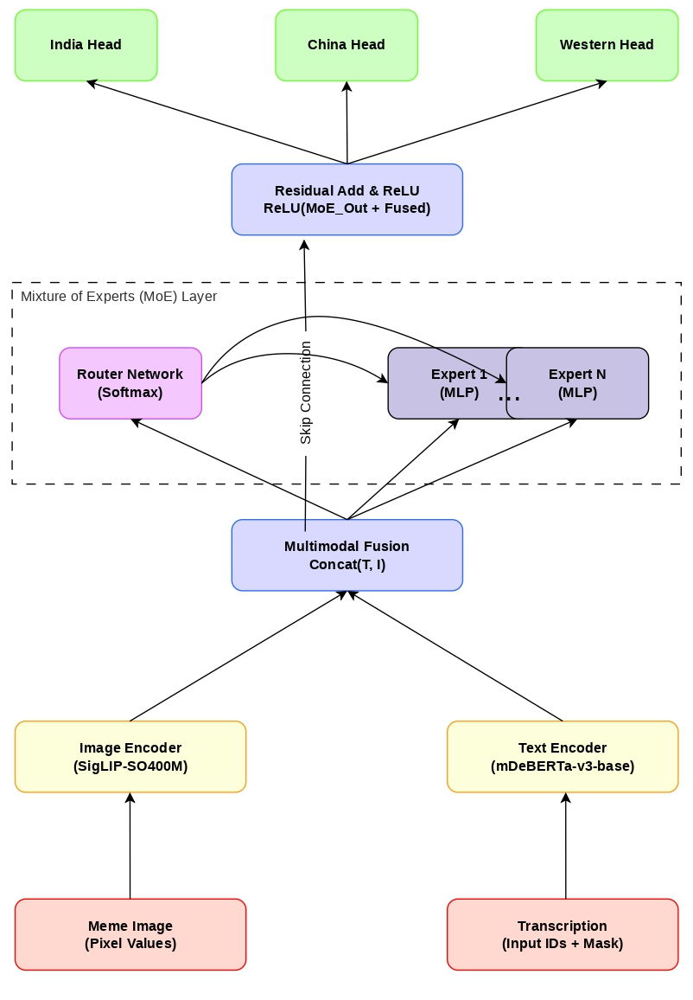

## Architecture Overview

Our proposed architecture fuses textual features from mDeBERTa-v3 and visual features from SigLIP, then routes the combined representation through a custom Mixture of Experts (MoE) layer. This MoE layer dynamically weights specialized subnetworks to capture nuanced cultural variation, and feeds the result into dedicated classification heads for Indian, Chinese, and Western cultural perspectives.



## Key Results

Our system achieves highly competitive results on the official CC-MMD2026 leaderboard:
* **Rank 3** in Malayalam and English
* **Rank 5** in Chinese
* **Rank 6** in Tamil
* **Rank 2 Overall** among all participating teams based on an unofficial average Macro-F1 across all four language subsets, demonstrating robust cross-cultural generalization with improvements exceeding 0.42 Macro-F1 points over the official Gemma3-4b baseline.

## Citation

If you use this code or our findings in your research, please cite our paper:

> Pranava Mohan, Sekar M, and A. Santhanavijayan, 2026. tensorveeras@CC-MMD 2026: Cross-Cultural Misogynistic Meme Detection using a Multimodal Mixture of Experts. In INTERNATIONAL CONFERENCE ON MULTIMODAL INTERACTION (ICMI '26), October 05-09, 2026, Napoli, Italy. ACM, New York, NY, USA, 5 pages. https://doi.org/10.1145/3776574.3832467

```bibtex
@inproceedings{tensorveeras2026ccmmd,
  title={tensorveeras@CC-MMD 2026: Cross-Cultural Misogynistic Meme Detection using a Multimodal Mixture of Experts},
  author={Mohan, Pranava and M, Sekar and Santhanavijayan, A.},
  booktitle={INTERNATIONAL CONFERENCE ON MULTIMODAL INTERACTION (ICMI '26)},
  year={2026},
  location={Napoli, Italy},
  publisher={ACM},
  doi={10.1145/3776574.3832467}
}
```

## Ethics and Privacy Statement

This research addresses automated detection of harmful misogynistic content, with the broader aim of contributing to safer online environments. We acknowledge the potential for dual use, as automated moderation tools can mistakenly flag benign cultural expressions when training data encodes cultural biases. No personally identifiable information was used beyond the publicly released challenge datasets.

## Acknowledgments

We acknowledge the National Supercomputing Mission (NSM) for providing the "PARAM Porul" computing resources at NIT Tiruchirappalli, implemented by C-DAC and supported by Meity and DST, Government of India.